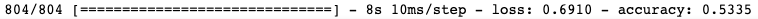
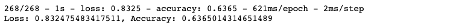
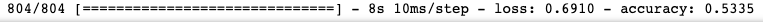
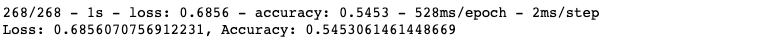

# Neural_Network_Charity_Analysis

## Objective
For this project, I used neural networks to create a binary classifer that will predict whether an organization will be successful if funded by the investment company, Alphabet Soup.  

Neural networks rely on training data to learn and improve their accuracy overtime.   The structure mimics the way human biological neurons signal to one another.  

### Tasks
- Preprocess data for a neural network model
- Compile, train, and evaluate the model
- Optimize the model

## Resources

### Tools/Languages
- TensorFlow 2.8.0
- Visual Studio Code 1.66.1
- Jupyter Notebook 6.4.5
- Scikit-Learn 1.0.2
- Pandas 1.3.4

### Data/Sites
- charity_data.csv (Contains information on organizations that have received funding from Alphabet Soup)
- https://stackoverflow.com/questions/59069058/save-model-every-10-epochs-tensorflow-keras-v2

## Results

### Data Preprocessing
- The target variable for both models was 'IS_SUCCESSFUL' because we need to know which investments have been successful so far.

- For both models, the feature variables was every variable not dropped in the dataset except the target.

- Originally, only the EIN and NAME columns were dropped.  For the optimized model, I dropped multiple additional columns from the optimization analysis model they may have caused outliers in the original analysis.

### Compiling, Training, and Evaluation
- I chose at least 80 neurons for the first layer, 30 neurons for the second layer, and added an additional layer to test my analysis.  I assumed that the large amount of neurons with help the model and increase the accuracy.

- Unfortunately, I was not able to achieve more than 75% accuracy for my model. 

- The steps I took to increase model performance were adding more neurons to the hidden layer, adding an additional hidden layer, changing the activation function, and removing unnecessary columns.

### Original Analysis Results

#### Training Data

The original training data was only 53% accurate and had a loss of 69%.

#### Test Data

The original test data was only about 64% accurate and had a major loss of 83%.

### Final Optimized Analysis Results

#### Training Data

The optimized training data was only 53% accurate and had a loss of about 69%.

#### Test Data

The optimized test data was only about 55% accurate and had a loss of 69%.

## Summary

There was minimum change in accuracy from the original model to the optimized model.  

I believe an SVM model would be a better alternative for analyzing this type of dataset.  This type of model can handle both processed and unprocessed data.

